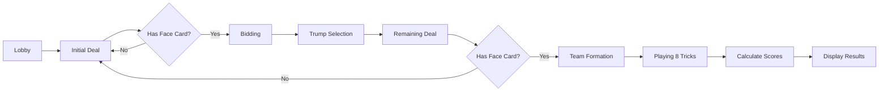

# Game Mechanics - Dhaiso Card Game

## Overview

Dhaiso is a trick-taking card game for **exactly 5 players**. Players compete in two teams: the **Caller's Team** vs **Defense Team**. The game involves bidding, trump selection, and strategic card play.

## 🎴 Card Deck

### Composition
- **40 cards total** (standard 52-card deck minus 2s, 3s, and 4s)
- **4 suits:** Hearts (♥), Diamonds (♦), Clubs (♣), Spades (♠)
- **10 ranks per suit:** 5, 6, 7, 8, 9, 10, J, Q, K, A

### Card Values (Points)

| Card | Points |
|------|--------|
| Jack (J) | 5 |
| Queen (Q) | 10 |
| King (K) | 15 |
| Ace (A) | 20 |
| Queen of Spades (Q♠) | **60** (special) |
| All others | 0 |

**Total points in deck:** 170

## 🎲 Game Flow

### 1. Setup Phase (Lobby)

- 5 players join the game
- Each player enters a unique name (max 20 characters)
- Any player can start when all 5 have joined

### 2. Initial Deal

- Deck is shuffled
- Each player receives **5 cards**
- **Reshuffle rule:** If any player has no face cards (J, Q, K, A), the game restarts with a new shuffle

### 3. Bidding Phase

Players take turns bidding on the minimum points they believe they can win.

- **Minimum bid:** 170 (total points in deck)
- **Turn order:** Starts with first player, proceeds clockwise
- Each player can:
  - **Call** with a higher bid than current
  - **Pass** and sit out remaining bids

**Example:**
```
Player 1: Calls 170
Player 2: Calls 180
Player 3: Pass
Player 4: Pass
Player 5: Pass
Winner: Player 2 (bid = 180)
```

### 4. Trump Selection

The highest bidder becomes the **Caller** and:

1. **Selects Trump Suit:** One of ♥, ♦, ♣, ♠
2. **Selects 2 Friend Cards:** Any two cards by rank and suit
   - **Restriction:** Cannot select Ace of Spades (A♠)
   - Can select cards they already hold
   - Players who hold these cards will be on Caller's team

### 5. Remaining Deal

- Each player receives **3 more cards**
- Total hand: **8 cards**
- **Reshuffle check:** If any player has no face cards after this deal, game restarts

### 6. Team Formation

Teams are formed based on who holds the friend cards:

- **Caller's Team:** Caller + players holding friend cards
- **Defense Team:** All other players

**Example:**
```
Caller: Alice (selected K♥ and 10♦ as friends)
Bob holds K♥ → Alice's team
Charlie holds 10♦ → Alice's team
David and Eve → Defense team

Final teams:
Caller: Alice, Bob, Charlie (3 players)
Defense: David, Eve (2 players)
```

**Note:** Team sizes can be 2-3, 3-2, or 4-1 depending on who holds friends.

### 7. Playing Phase

**8 tricks** are played (since each player has 8 cards).

#### Trick Rules

1. **Lead:** Caller plays first card in first trick
2. **Follow Suit:** Players must play same suit as lead card if they have it
3. **Trump:** If void in lead suit, can play any card (including trump)
4. **Win Trick:** 
   - Trump cards beat all non-trump cards
   - Among same suit, highest rank wins
   - Winner leads next trick

#### Card Hierarchy (for winning tricks)

**Within a suit:**
```
A (power 14) > K (13) > Q (12) > J (11) > 10 (10) > 9 (9) > ... > 5 (5)
```

**Overall:**
```
Trump suit > Lead suit > Other suits (can't win)
```

#### Trick Delay

After all 5 players play a card, there's a **5-second delay** before the pot clears, allowing players to see all played cards.

### 8. Scoring & End Game

After all 8 tricks:

**Calculate Team Points:**
- Sum all card values won by each team
- **Caller's Team** needs to reach their bid to win

**Win Condition:**
```
if (callerTeamPoints >= bid) {
    Caller's team wins
} else {
    Defense team wins
}
```

**Example:**
```
Bid: 180
Caller's Team: 185 points → Caller Wins! 🎉
Defense Team: 45 points (total 230, but doesn't matter)
```

## 🎯 Strategy Tips

1. **Bidding:**
   - Don't overbid - you need to win that many points
   - Consider trump advantage and friend selection

2. **Friend Selection:**
   - High-value cards (Kings, Aces) are good friends
   - Consider cards you don't have for allies
   - Can't select A♠ (restricted)

3. **Card Play:**
   - Lead with strong cards when winning
   - Save trump for critical moments
   - Remember Queen of Spades is worth 60 points!

## 🔄 Special Rules Summary

| Rule | Description |
|------|-------------|
| **No Face Card Reshuffle** | Game restarts if any player has no J, Q, K, or A after full deal |
| **A♠ Restriction** | Ace of Spades cannot be selected as a friend card |
| **Must Follow Suit** | Players must play lead suit if they have it |
| **Minimum Bid** | 170 (all points in deck) |
| **Exact Player Count** | Always 5 players, no more, no less |

## 🎮 UI Indicators

- **Yellow highlight:** Current player's turn
- **Friend cards displayed:** Top banner shows selected friends
- **Score tracking:** Real-time score visible for each player
- **Turn indicator:** Pulsing yellow dot on current player

## 📊 Phases Summary



## 🎲 Example Full Game

**Players:** Alice, Bob, Charlie, David, Eve

1. **Deal:** Each gets 5 cards
2. **Bidding:** Alice bids 180, others pass
3. **Trump:** Alice selects ♠ as trump, K♥ and Q♦ as friends
4. **Remaining Deal:** Each gets 3 more cards
5. **Teams:** Bob has K♥, David has Q♦ → Alice + Bob + David vs Charlie + Eve
6. **Playing:** 8 tricks played, Alice's team wins tricks worth 190 points
7. **Result:** Caller's team wins (190 ≥ 180) 🎉

---

**Now you understand Dhaiso!** Ready to contribute? See [CONTRIBUTING.md](../CONTRIBUTING.md)
