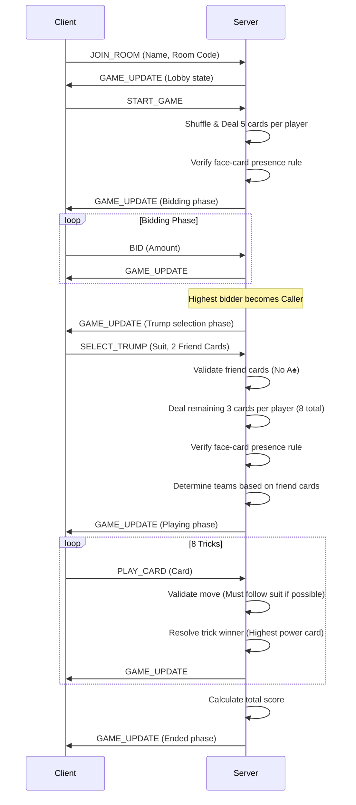

# Dhaiso Game Mechanics

Dhaiso is a trick-taking card game played by exactly 5 players. The players compete in two teams: the **Caller's Team** and the **Defense Team**. Team assignments are dynamic and remain secret until specific cards are played.

## Deck Composition and Card Values

The game uses a **40-card deck** derived from a standard 52-card deck by removing all 2s, 3s, and 4s.

### Ranks and Suit Structure
- **Suits**: Hearts (♥), Diamonds (♦), Clubs (♣), Spades (♠)
- **Ranks (low to high)**: 5, 6, 7, 8, 9, 10, J, Q, K, A

### Card Point Values
Points are awarded for winning tricks containing the following face cards and high cards:

| Card | Points |
| :--- | :--- |
| Jack (J) | 5 points |
| Queen (Q) | 10 points |
| King (K) | 15 points |
| Ace (A) | 20 points |
| Queen of Spades (Q♠) | 60 points (Special) |
| All other cards (5–10) | 0 points |

**Total points in the deck**: 170

---

## Game Flow Sequence



---

## Phase Breakdown

### 1. Initial Deal
- The deck is shuffled, and each player is dealt **5 cards**.
- **Face-Card Reshuffle Rule**: If any player is dealt a hand containing zero face cards (J, Q, K, A), the hand is declared void. The server automatically reshuffles and redeals the cards.

### 2. Bidding Phase
- Starting with the first player and moving clockwise, players bid on the minimum points they expect to win.
- **Minimum Bid**: 170 (the total point pool). Bids must increase in increments of at least 5.
- Players may choose to **Pass**, which excludes them from further bidding in the current round.
- The bidding phase ends when all players except one have passed. The last active bidder becomes the **Caller**.

### 3. Trump and Friend Selection
The Caller defines the parameters of the game:
1. **Trump Suit**: Selects one of the four suits to act as the trump suit.
2. **Two Friend Cards**: Nominates two cards by rank and suit.
   - **Restriction**: The Ace of Spades (A♠) cannot be selected as a friend card.
   - The Caller can select cards they already hold in their own hand.

### 4. Remaining Deal and Team Assignment
- After selection, the remaining 3 cards are dealt to each player (total of 8 cards in hand).
- The face-card presence check is executed again. If any player still lacks a J, Q, K, or A, the round is restarted.
- **Teammate Assignment**: Players holding the two nominated friend cards join the Caller to form the **Caller's Team**. All other players form the **Defense Team**.
- **Secret Identity**: Team assignments are not explicitly revealed by the server. Players deduce team memberships as the nominated friend cards are played during tricks.

### 5. Trick Play
The round consists of **8 tricks**:
- **Lead**: The Caller leads the first card of the first trick. For subsequent tricks, the winner of the previous trick leads.
- **Follow Suit**: Players must play a card of the leading suit if they have one.
- **Void Suit**: If a player has no cards of the leading suit, they may play any card (either a trump card or a discard from another suit).
- **Trick Resolution**: 
  - A trump card beats any card of a non-trump suit.
  - Among cards of the same suit, the card with the highest rank wins.
  - Cards of a non-lead, non-trump suit cannot win the trick.

#### Card Power Ranking (Trick Resolution)
Within a single suit, cards rank from lowest to highest:
```
5 < 6 < 7 < 8 < 9 < 10 < Jack < Queen < King < Ace
```

### 6. Scoring and Win Conditions
At the end of 8 tricks:
- The server sums the point values of all cards won by each team.
- If the Caller's Team wins points **equal to or greater than** the winning bid, the Caller's Team wins the round.
- Otherwise, the Defense Team wins.

---

## Special Rules Reference

- **No-Face-Card Reshuffle**: Hand is voided and reshuffled if a player has no J, Q, K, or A after the initial or final deal.
- **A♠ Exclusivity**: The Ace of Spades (A♠) cannot be called as a friend card, preventing it from forcing a team assignment.
- **Turn Enforcement**: A 5-second post-trick buffer is enforced by the server after the 5th card is played. This allows clients to inspect the completed trick before the cards are cleared.
