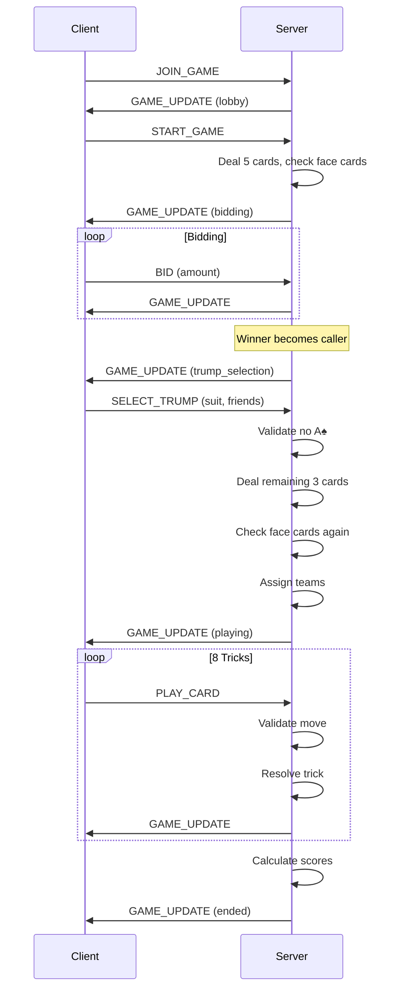

# Dhaiso Game Flow

## Overview

Dhaiso is a 5-player trick-taking card game with bidding, trump selection, and team formation.

## Game Rules Summary

### Deck
- Standard 52-card deck with 2, 3, and 4 removed (40 cards total)
- Cards: 5, 6, 7, 8, 9, 10, J, Q, K, A in all 4 suits

### Point Values
| Card | Points |
|------|--------|
| Jack (J) | 5 |
| Queen (Q) | 10 |
| King (K) | 15 |
| Ace (A) | 20 |
| Queen of Spades (Q♠) | 60 |
| 5, 6, 7, 8, 9, 10 | 0 |

### Team Formation
- The caller (highest bidder) selects 2 "friend" cards
- Players holding these friend cards are on the caller's team
- Ace of Spades (A♠) cannot be selected as a friend card
- All other players form the defense team

### Gameplay
1. Must follow suit if possible
2. If void in lead suit, can play trump to win or discard
3. Highest trump wins, otherwise highest of lead suit wins
4. Winner of each trick leads the next

### Winning
- Caller's team must score ≥ the bid amount to win
- If any player has no face cards (J, Q, K, A) after full deal, game restarts

---

## Architecture Diagram

---

## Game Phases

### 1. Lobby Phase
- Players join the game (up to 5)
- Game starts when all 5 players are present

### 2. Bidding Phase
- Each player receives 5 cards initially
- Players bid or pass in turn order
- Minimum bid: 170
- Highest bidder becomes the "caller"

### 3. Trump Selection Phase
- Caller selects:
  - Trump suit (♠, ♥, ♦, ♣)
  - Two friend cards (cannot be A♠)
- Remaining 3 cards dealt to each player (8 total per player)

### 4. Playing Phase
- 8 tricks are played
- Caller leads the first trick
- Winner of each trick leads the next

### 5. End Phase
- Scores calculated
- Caller's team wins if total ≥ bid
- Results displayed
